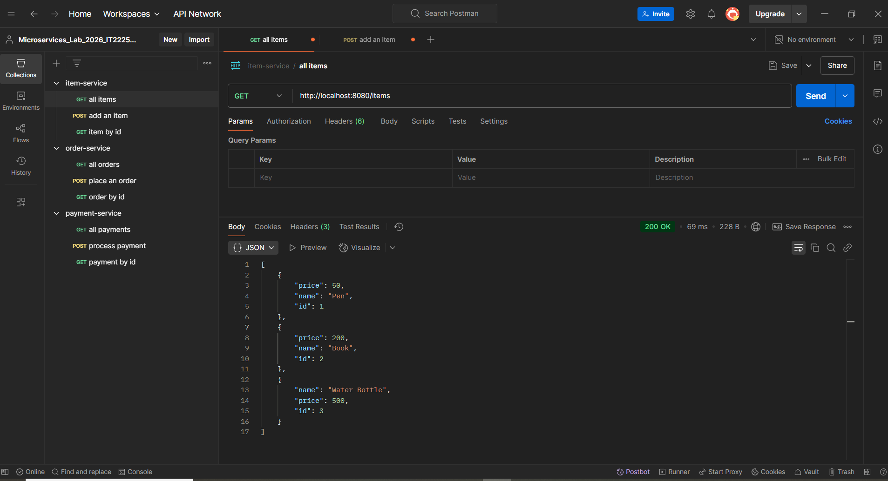

🚀 Microservices Lab - IT22251664

Module: Current Trends in Software Engineering (SE4010) - 2026

🧩 Spring Boot + 🌐 API Gateway + 🐳 Docker

📖 Project Overview

This project demonstrates a Microservices Architecture built using:

    ☕ Spring Boot
    🌐 Spring Cloud Gateway
    🐳 Docker
    📦 Docker Compose
    🧪 Postman

The system consists of 3 independent microservices, all accessed through a single API Gateway.

🏗️ System Architecture
    
    Client (Postman / Browser)
            │
            ▼
    🌐 API Gateway (8080)
            │
    ┌────────┼────────┐
    ▼        ▼        ▼
    📦 Item   🧾 Order  💳 Payment
    (8081)   (8082)     (8083)

📌 Services & Ports

    | Service Name       | Port | Description         |
    | ------------------ | ---- | ------------------- |
    | 🌐 API Gateway     | 8080 | Routes all requests |
    | 📦 Item Service    | 8081 | Manages products    |
    | 🧾 Order Service   | 8082 | Manages orders      |
    | 💳 Payment Service | 8083 | Manages payments    |

🔁 Gateway Routing Rules

    | Request Path   | Routed To       |
    | -------------- | --------------- |
    | `/items/**`    | Item Service    |
    | `/orders/**`   | Order Service   |
    | `/payments/**` | Payment Service |

All client requests must go through:
    http://localhost:8080

🛠️ Technologies Used

    ☕ Java 17
    🌱 Spring Boot 3.x
    🌐 Spring Cloud Gateway
    📦 Maven
    🐳 Docker
    🐳 Docker Compose
    🧪 Postman

📂 Project Structure
    
    microservices-lab/
    │
    ├── 📦 item-service/
    ├── 🧾 order-service/
    ├── 💳 payment-service/
    ├── 🌐 api-gateway/
    ├── 🐳 docker-compose.yml
    └── 📘 README.md

    Each service contains:
        Spring Boot Application
        REST Controller
        Dockerfile
        Maven Configuration

🐳 Running the Project

    🔹 Step 1: Build All Services
        From the root folder:
            docker-compose build
    
    🔹 Step 2: Start All Containers
        docker-compose up
    
    🔹 Step 3: Check Running Containers
        docker ps

We should see 4 running containers:
    item-service
    order-service
    payment-service
    api-gateway

🧪 API Testing (Postman)
    ⚠️ All requests must go through API Gateway (Port 8080)

    📦 Item Service
        🔹 Get All Items
            GET http://localhost:8080/items

